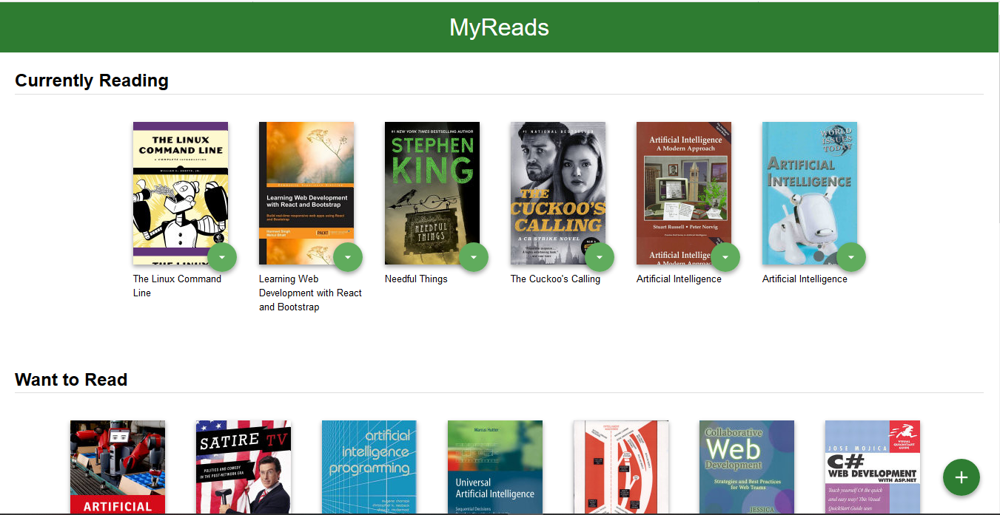
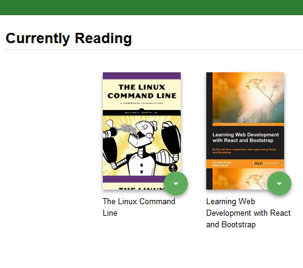
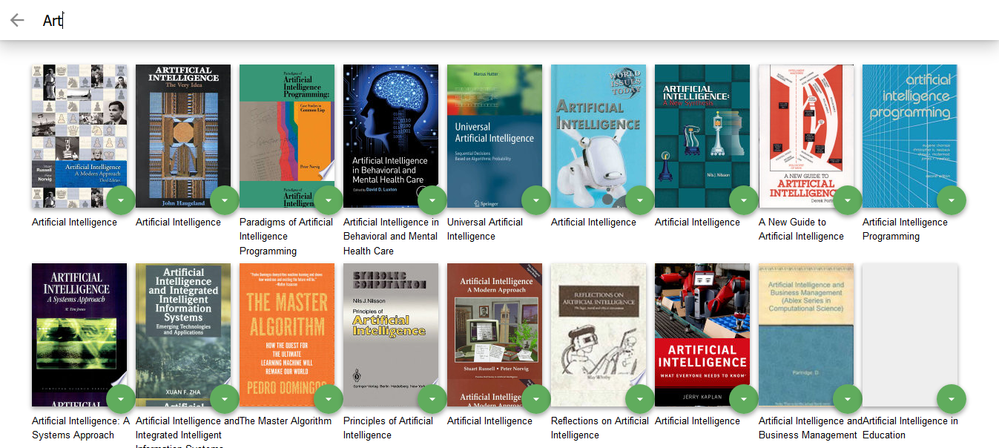

# MyReads Project
  virtual bookcase to store your books and track what you're reading.
   
### Features :
  - The main page shows 3 shelves for books [current reading , want to read , read ] 
  - Each book is shown on the correct shelf, along with its title and all of its authors. 
  - Move books from one shelf to another.
  - Search for books by the title or the authors and add them to one of the shelves.

## Code Stucture :
```bash
├── README.md - This file.
├── SEARCH_TERMS.md # The whitelisted short collection of available search terms for you to use with your app.
├── package.json # npm package manager file. It's unlikely that you'll need to modify this.
├── public
│   ├── favicon.ico # React Icon, You may change if you wish.
│   └── index.html # DO NOT MODIFY
└── src
    ├── App.css # Styles for your app. Feel free to customize this as you desire.
    ├── App.js # This is the root of your app. Contains static HTML right now.
    ├── App.test.js # Used for testing. Provided with Create React App. Testing is encouraged, but not required.
    ├── Book.jsx # book Component and its own state
    ├── BooksAPI.js # A JavaScript API for the provided Udacity backend. Instructions for the methods are below.
    ├── BookShelf.jsx # Component to render books related to specific shelf
    ├── index.css # Global styles. You probably won't need to change anything here.
    ├── icons # Helpful images for your app. Use at your discretion.
    │   ├── add.svg
    │   ├── arrow-back.svg
    │   └── arrow-drop-down.svg
    ├── screenshots # images for the website
    ├── index.css # Global styles. You probably won't need to change anything here.
    ├── SearchBooks.jsx # Component for search for books and render the results 
    └── index.js # You should not need to modify this file. It is used for DOM rendering only.
```

## Instructions to install and use :
The project uses Node.js and the Create-React-App starter. If you do not have Node >= 6.x installed, you can download it here: [Node.js](https://nodejs.org/en/)

Once Node is installed, navigate to the directory where you want to store the app

```
git clone https://github.com/Aboeleneen/React-Nanodegree-Projects.git
``` 
navigate to myreads project then 

```
npm install
```

Once all of the dependencies have been installed you can launch the app with

```
npm start
```

A new browser window should automatically open displaying the app. If it doesn't, navigate to [http://localhost:3000/](http://localhost:3000/) in your browser

## User Guide :
  - Books are sorted into three categories: Currently Reading, Want to Read and Read
  - To change a book's category or remove a book from the list, click on the green button on the book cover
    

  - To add new books, click on the green + button at the bottom of the page.
    Enter an author's name or subject. Up to 20 items will be returned.

  _Note: The backend API is limited to a fixed set of [search terms](#search-terms) -- see below for valid search options_
  


  
