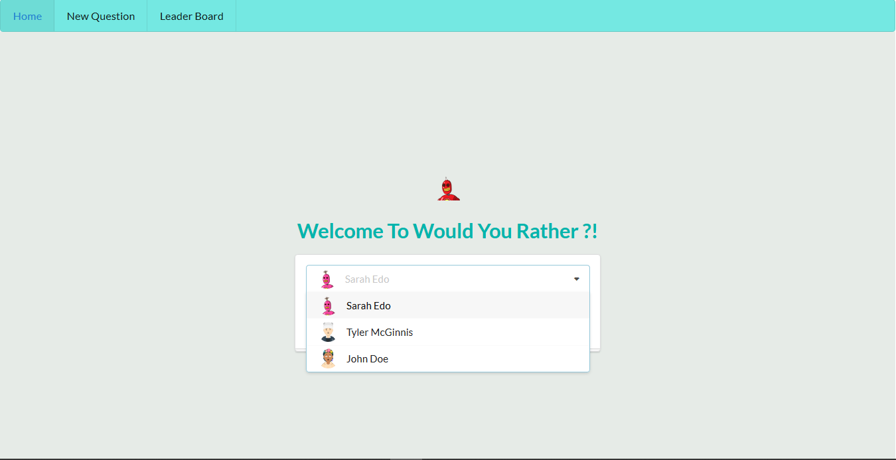
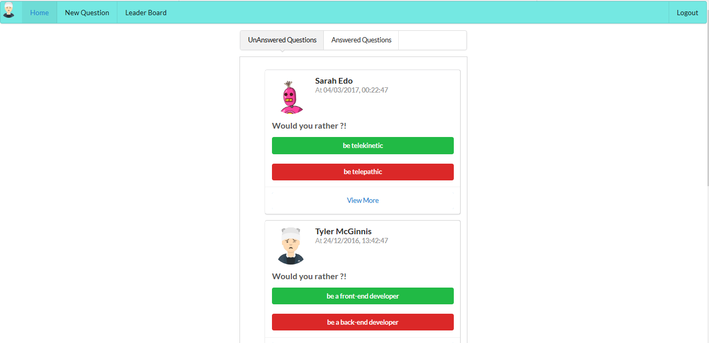
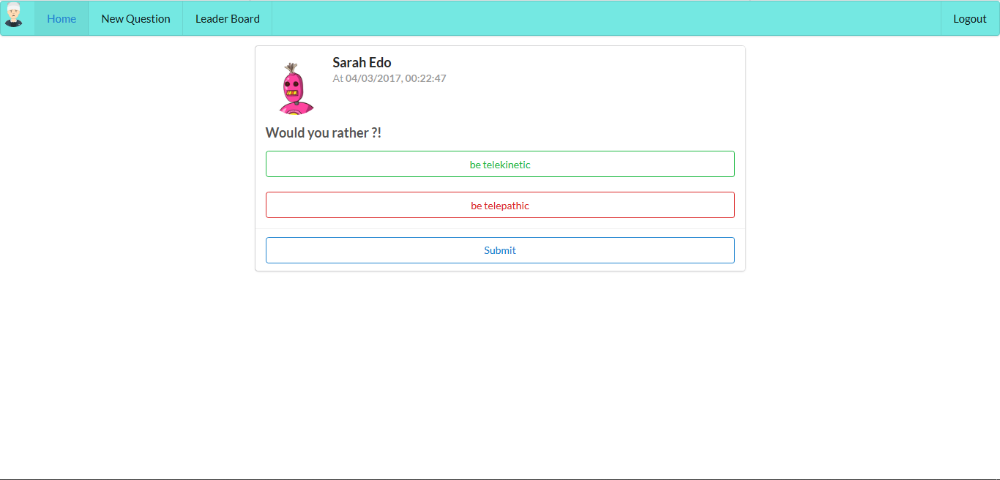
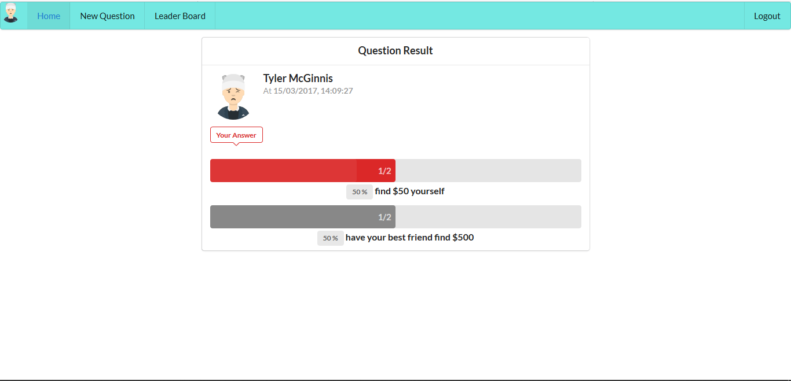
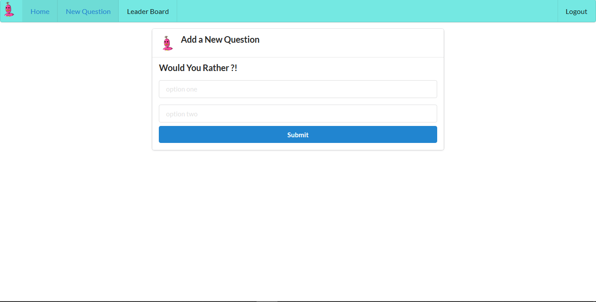
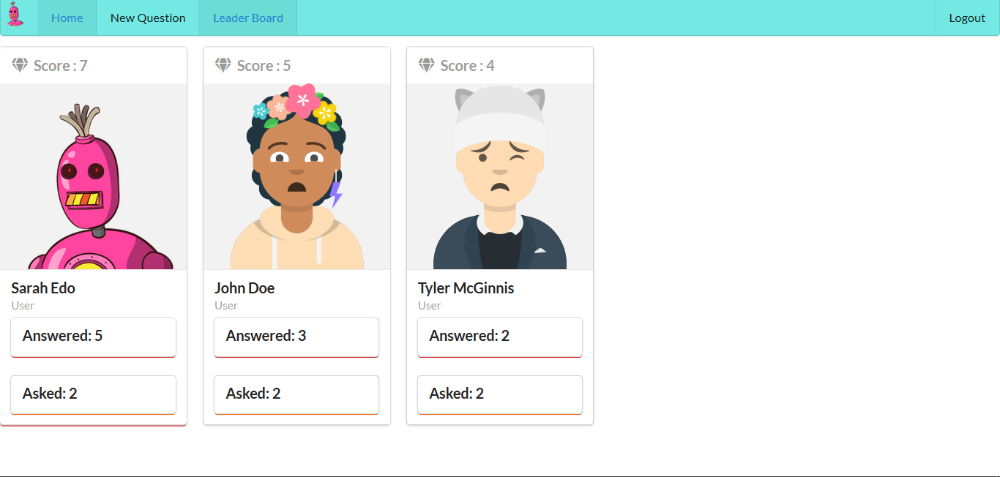

# Would You Rather Project
  Web Application which helps users to create surveys developed by React and Semantic-UI
  
### Features :
  - post questions
  - Answer questions
  - See answered and unanswered questions
  - See how other people have voted
  - See the ranking of users on the leaderboard

### Instructions to install and use :
The project uses Node.js and the Create-React-App starter. If you do not have Node >= 6.x installed, you can download it here: [Node.js](https://nodejs.org/en/)

Once Node is installed, navigate to the directory where you want to store the app

```
git clone https://github.com/Aboeleneen/React-Nanodegree-Projects.git
``` 
navigate to would-you-rather project then 

```
yarn install
```

Once all of the dependencies have been installed you can launch the app with

```
yarn start
```

A new browser window should automatically open displaying the app. If it doesn't, navigate to [http://localhost:3000/](http://localhost:3000/) in your browser

### User Guide 
  - Log in with existing user 
    
  - Home Page show unanswered questions by default and you can navigate to answered questions
    
  - to answer a question : click on *view more* in unanswered questions tab to view the selected question and vote for one choices then click submit
    
  - to view voting result : navigate to answered questions tab then click on *view more* for the selected questions
    
  - to post a new question : click on *New Question* in the navbar , add your two chocies then click submit
    
  - to view the leaderboard : click on *LeaderBoard* in the navbar
    
  - you can logout by clicking *logout* in the navbar
